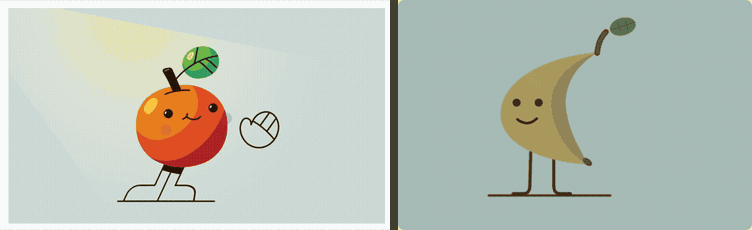
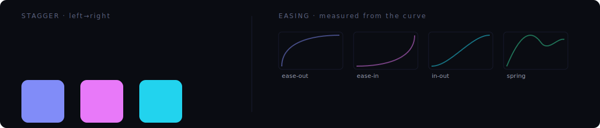

<p align="center">
  
</p>

<h1 align="center">motiscope</h1>

<p align="center">
  <b>See the motion, recreate the animation.</b><br>
  Drop a screen recording of an animation — get working <b>GSAP / CSS / Framer Motion / Lottie</b> code.
</p>

<p align="center">
  
  
  
  
</p>

<p align="center">
  <a href="https://kumarsashank.github.io/motiscope/"><b>🔗 Live site</b></a> ·
  <a href="QUICKSTART.md">Quickstart</a> ·
  <a href="#install">Install</a> ·
  <a href="#how-it-works">How it works</a>
</p>

---

A Claude Code plugin dedicated to motion design. Pure Python (standard library) +
`ffmpeg`. No cloud, no npm, no accounts required.

> "I want this animation on my site." — drop the clip, run `/motiscope:analyze`,
> then `/motiscope:recreate gsap`.

## Demo — original → recreated

<p align="center">
  
</p>

<p align="center"><sub><b>Left:</b> the original. &nbsp;<b>Right:</b> recreated with motiscope. &nbsp;<i>(one clip, so the beats stay in sync)</i></sub></p>

motiscope measured the **motion** of the tomato — a 4.45s clock, the wake-and-wave beats,
and the easing curve of each. The **banana is an original character** built on that
measured motion: an 11 KB animated SVG. *The timing transfers; the artwork doesn't have to.*

Original animation from [SVGator's website-animation examples](https://www.svgator.com/blog/website-animation-examples-and-effects/)
— all credit to the original creator. → [full example](docs/examples/banana/) ·
[gallery](https://kumarsashank.github.io/motiscope/gallery.html)

## How it works

<p align="center"></p>

motiscope does the one thing a vision model **can't** do from a screenshot — measure
*time* — and hands everything else to the model:

1. **The numbers measure the WHEN.** A dense per-frame *motion-energy curve* (native
   fps, effectively free) plus ffmpeg signal analysis (`scdet`, `freezedetect`,
   `blackdetect`, `siti`, `signalstats`) give the exact **timing**: durations, the
   per-segment **easing curve** (a real `cubic-bezier` fitted from the velocity
   profile), beat/segment boundaries, stagger timing, and loop period. A still has no
   time axis — so this is the part that can't be guessed. It's the moat.
2. **The frames carry the WHAT.** motiscope curates the keyframes that matter (chosen
   by the motion signal) and hands them to the model. Claude reads them with full
   vision to identify the elements and *what kind of animation* each is — fade, slide,
   scale, mask reveal, path draw, morph, 3D flip, text effect, whatever it sees.
   **motiscope deliberately does not classify animation types** — the model is better
   at that than any hand-coded taxonomy, so there's no fixed list to box you in.

So: **measured timing + curated frames → the model recreates it.** motiscope is a
precise stopwatch and a smart frame-picker; the intelligence is Claude's.

## The motions it reads & rebuilds

<p align="center"></p>

Staggered entrances, easing curves, holds, fades, loops — read off the energy curve
and rebuilt as code. *(These figures are animated SVGs — the same kind of motion
motiscope recreates.)*

## Install

```
/plugin marketplace add github:KumarSashank/motiscope
/plugin install motiscope@motiscope
```

Requires `ffmpeg` + `ffprobe`. Run `/motiscope:doctor` to check and (with your
consent) install them (`brew install ffmpeg` on macOS). New here? See
**[QUICKSTART.md](QUICKSTART.md)**.

## Usage

```
/motiscope:doctor                      # verify deps, scaffold config (first run)
/motiscope:analyze animations/hero.mp4 # analyze a recording -> animation spec
/motiscope:recreate gsap               # emit GSAP code (or css | framer | lottie)
```

Or just drop a recording into an `animations/` folder in your project and run
`/motiscope:analyze` — it will find it.

**Local files only.** Supported: `.mp4 .mov .webm .mkv .m4v .avi .gif`. To capture a
web animation, screen-record it and save the file.

## Commands

| Command | What it does |
|---|---|
| `/motiscope:analyze [path] [notes]` | Extract the motion analysis + curated frames, then characterize the animation as a spec. |
| `/motiscope:recreate [gsap\|css\|framer\|lottie] [out-dir]` | Turn the spec into runnable code for a target framework. |
| `/motiscope:rebuild-site [path] [gsap\|css\|framer]` | Rebuild a **whole landing page** from a walkthrough recording — sections, copy, design system, scroll animations, and generated assets. |
| `/motiscope:doctor` | Verify `ffmpeg`/`ffprobe`; scaffold `~/.config/motiscope/{config.json,.env}`. |

GSAP output leans on the official GSAP skills (timeline / core / scrolltrigger /
react / utils) for idiomatic results.

## Controlling frames & token cost

Only the curated frames the model *sees* cost tokens (~300–400 each); the numeric
analysis is free. Frame count tracks **motion complexity**, capped by a preset — it
does **not** grow with video length (a 10s clip typically yields ~10 frames).

| Preset | Frame cap | Resolution | Use when |
|---|---|---|---|
| `draft` | 12 | 512px | quick look, tight budget |
| `balanced` *(default)* | 32 (usually 8–20 after dedup) | 640px | most cases |
| `detailed` | 48 | 960px | dense sequences / reading text |
| `landing` | 44 | 1280px | web/landing walkthroughs — cover each section + its motion |

- **Focus a section** of a longer video: `--start 0:12 --end 0:15` (timestamps come
  back in absolute source time).
- **Sample fast content densely**: `--fps 20` lays a uniform backbone (a frame every
  ~50ms) across the window; near-identical frames still collapse unless `--no-dedup`.
- **Auto-decompose** (default for clips ≥8s with ≥2 motion beats): finds the beats,
  drills each motion segment densely, and skips holds — the budget follows the motion.
  Frames are allocated **per beat by motion magnitude** (a fast/intense beat gets more
  frames than a slow one). Force with `--decompose` / disable with `--no-decompose`.
- **Loop detection**: looping animations are detected (energy-curve autocorrelation)
  and reported with a period, so recreation can set `repeat` / `yoyo`.

Small elements register correctly: the primary motion signal is *localized* (built
from the most-active regions), so a small button/card/icon moving on a large page is
detected as real motion rather than washing out in a whole-frame average.

## Output layout

Per-video working files land in a gitignored `.motiscope/<slug>/`:

```
.motiscope/<slug>/
  manifest.json   # video meta + timeline + frame index (machine artifact)
  motion.json     # raw motion timeline: energy curve, grid, segments, beats, signals
  report.md       # human-readable summary (energy sparkline, segment table)
  frames/         # curated PNGs, e.g. frame_003_t0.42s_keypose.png
```

Recreated code is written to `motiscope-output/<target>/` by default.

## Asset generation (optional)

If a recreation needs an image, `recreate` will ask whether to point at your own file,
generate one, or use a placeholder. **Image generation is real via the `gemini` /
`imagen` provider** (Imagen through the Gemini API) — set `GEMINI_API_KEY` in
`~/.config/motiscope/.env` (mode `0600`; keys are never printed, written into generated
code, or committed). Other providers (video, and other image backends) still write a
labeled placeholder until wired.

```
python3 scripts/assetgen.py generate --type image --provider gemini \
  --prompt "cinematic hands holding a phone, dark teal grade" --out hero.png --aspect-ratio 16:9
```

Provider slots: image — **gemini/imagen (implemented)**, OpenAI, Stability, Replicate,
fal; video — Runway, Replicate, fal.

## Limitations (measured vs. estimated)

- **Measured (reliable):** duration, fps, segment boundaries, easing *shape*,
  hold/fade detection, stagger *direction*, loop period.
- **Estimated (from frames):** which elements move, transform magnitudes (px / scale
  / rotation / opacity), colors under compression, exact overshoot, spring stiffness.
- **Not recoverable from frames:** exact cubic-bezier control points (only the class),
  sub-pixel / sub-frame motion, true 3D / z-order, authored Lottie vector data. For
  production Lottie, author in After Effects.
- A very gentle **ease-in**'s opening can read as a short hold because sub-pixel
  motion is invisible in the analysis thumbnails — the dominant easing is still
  recovered; check the first frames.

**For best results:** capture at a high frame rate and avoid heavy compression.

## Development

See [CONTRIBUTING.md](CONTRIBUTING.md). Run the test suite:

```
python3 -m unittest tests.test_analyze_motion
```

## Credits & license

MIT. See [LICENSE](LICENSE). motiscope adapts frame-analysis techniques from two MIT
projects — [claude-video](https://github.com/bradautomates/claude-video) and
[claude-video-vision](https://github.com/jordanrendric/claude-video-vision) — with
gratitude; see [ATTRIBUTION.md](ATTRIBUTION.md).
