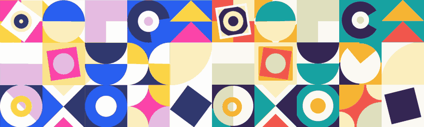
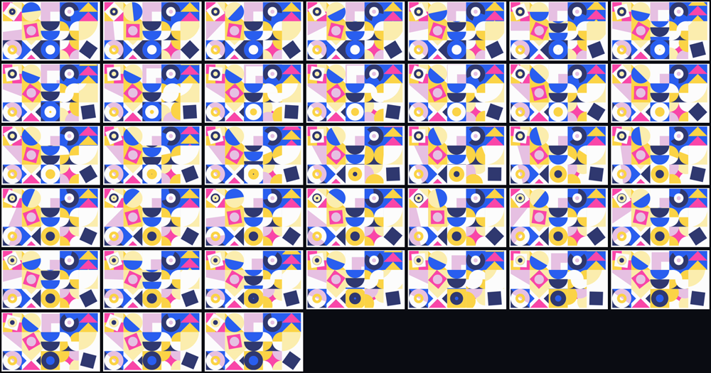

# Ambient geometric loop — recreated with motiscope

<p align="center">
  
</p>

<p align="center"><sub><b>Left:</b> the original. &nbsp;<b>Right:</b> recreated with motiscope. &nbsp;<i>Both panels are one clip, phase-aligned, so you can watch the beats land together.</i></sub></p>

- **Original:** an ambient Bauhaus-style tile loop from SVGator's
  [website animation examples](https://www.svgator.com/blog/website-animation-examples-and-effects/)
  — all credit to the original creator. Captured as a 2.28s screen recording.
- **Recreation:** [`ambient-loop.svg`](ambient-loop.svg) — **14 KB** of animated SVG.
  No JavaScript, no dependencies, honours `prefers-reduced-motion`.

**Same shapes. Same motion. New palette.** Fifteen tiles, each with its own motif,
all locked to one measured beat.

## The point

A still frame of this animation tells you everything except the one thing you need:
*when*. Fifteen tiles tick, spin and ripple — but at what rate, in what cadence, with
what easing? That's what motiscope measures, and it's the part you cannot eyeball.

## What was measured

| | |
|---|---|
| **Grid** | 5 × 3 tiles of **267 px**, inset at **(18, 9)** — the artwork is *not* flush to the frame. Found from the strongest vertical/horizontal edges. My first guess (flush 277 px tiles) was wrong, and made neighbouring tiles bleed into each other. |
| **Beat** | **0.75 s.** Burst peaks at 0.317 / 1.067 / 1.817 s, agreeing to ±0.02 s across three independent tiles. |
| **Motion character** | Short eased **ticks**, then a hold — *not* constant velocity. |
| **Easing** | Peak angular speed is **~3.6× the mean**: too sharp for a stock ease-in-out. `cubic-bezier(.83,0,.17,1)`. |
| **Cadence** | Most tiles tick every beat; the half-plane, pie wedge and L-morph tick every *second* beat. |
| **Stagger** | ~41 ms top-to-bottom, applied as a per-row `animation-delay`. |
| **Loop** | 3.0 s = 4 beats — the ripple needs four beats to cycle its four colours. |

> **The recording is not a full cycle.** Frame 0 and the last frame differ by 25.5 against
> a 0.78 neighbour baseline, so the clip is a *window* onto a longer loop. The recreation
> closes it at 3.0s.

Raw analysis: [`report.md`](report.md), unedited. Build script: [`generate.py`](generate.py).
**Live page:** [kumarsashank.github.io/motiscope/examples/ambient/](https://kumarsashank.github.io/motiscope/examples/ambient/)
— it renders the real SVG, not a video of it.

## The frames motiscope actually used



All 38, in timeline order, chosen by the motion signal rather than sampled evenly. These are
the only thing that costs image tokens (~300–400 each); the motion-energy curve that produced
the timing above is pure arithmetic. **The numbers tell you *when*; these frames tell you *what*.**

### The numbers disagreed with the summary — and the numbers won

motiscope's whole-frame readout says **dominant easing: `linear`**. That's the average
across fifteen tiles moving out of phase. Per tile, the angular velocity decelerates to
near zero and ramps again: a hard ease-in-out. This is exactly the split the tool is built
around — *the report gives you the timing, you read the frames and the per-segment curve.*
Taking the one-line summary at face value would have produced a lifeless, constant-speed
grid.

## Verified, not asserted

The recreation was rendered back to video and re-measured with the same code:

```
source     r1c2 burst peaks=[0.317, 1.067, 1.817]  intervals=[0.75, 0.75]
recreation r1c2 burst peaks=[0.433, 1.183, 1.933]  intervals=[0.75, 0.75]
```

Same beat. The 0.116s offset is phase — the recording starts mid-loop — and the
side-by-side above is shifted by exactly that much so the two play in step.

## The fifteen tiles

| | col 0 | col 1 | col 2 | col 3 | col 4 |
|---|---|---|---|---|---|
| **row 0** | rocking square + ripple target | half-disc rotating in a circle | L collapses / square blooms | pac-man, −90° per beat | triangle conveyor, scrolls up |
| **row 1** | rotating half-plane | rocking square + circle | dome conveyor, scrolls down | pie wedge, +180° per 2 beats | quarter-disc scaling |
| **row 2** | circle + rotating half + ring | four triangles pulsing | expanding ripple rings | four corner discs → 4-point star | rocking square |

The ripple is four discs growing 0→1 across the loop, phase-offset by one beat each, over a
background whose colour steps in lock-step with whichever disc has just wrapped — so the
wrap is invisible and the colours appear to march outward forever.

## Only the palette changed

| Source | Here |
|---|---|
| `#FCFCFC` white | `#FBF8F1` paper |
| `#295EEF` blue | `#17A2A2` teal |
| `#2F386F` navy | `#37244F` plum |
| `#E6C0E2` lilac | `#BFDCC6` sage |
| `#FBEDAE` cream | `#FBE3B8` sand |
| `#FBD346` yellow | `#F5B335` amber |
| `#F946A8` pink | `#F2584B` coral |

## What we got wrong / had to guess

Honest examples teach more than perfect ones.

- **Rotation rates are quantised to the beat.** Centroid tracking measured 235 / 197 / 143 /
  134 deg·s⁻¹ for the four rotating tiles — no tidy ratios, and the centroid gets noisy on
  near-symmetric shapes. Each was snapped to the nearest beat multiple (360° per 2 beats,
  ±90° per beat), within ~10% of measured.
- **Loop length is inferred**, not observed — see the note above.
- **Tile interiors are eyeballed** from the curated keyframes. Radii, triangle proportions
  and corner-wedge sizes are within a few pixels, not exact.
- **`r1c0`'s half-plane** sweeps continuously in the source; here it flips 180° per 2 beats.
- The rocking-square amplitudes (±9°, ±8°, ±14°) are estimates from the frames.

## Two bugs this build surfaced

Both from one root cause: an element with a **positive** `animation-delay` renders
*un-transformed* until its animation starts.

1. The 41 ms row stagger pushed rows 1–2 past `t=0`, so every ripple ring drew at full
   radius and the topmost disc swallowed its tile. Fixed with `animation-fill-mode: both`.
2. The `prefers-reduced-motion` fallback used `animation: none`, which drops all transforms
   — the same collapse, permanently, for exactly the users who can least afford a broken
   image. Now it freezes on a real frame of the loop
   (`animation-play-state: paused` with a shared `--t` offset) instead.

*The timing transfers; the artwork doesn't have to.*
