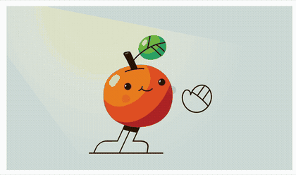

# Wake-up loop — tomato → banana

| Original (source) | Recreated with motiscope |
|:--:|:--:|
|  |  |

- **Original:** the tomato character animation from SVGator's
  [website animation examples](https://www.svgator.com/blog/website-animation-examples-and-effects/)
  — all credit to the original creator.
- **Recreation:** [`banana-loop.svg`](banana-loop.svg) — an **original banana character**,
  built as an animated SVG on the motion motiscope measured from the tomato.

## The point

motiscope measured the **timing** — a 4.45s clock and the beats: a hold in the dark →
the light coming on and the character waking → a settle → the wave — with the easing
curves for each. The banana's character, colours, and shapes are **original**; only the
*motion* was taken.

> **The timing transfers; the artwork doesn't have to.** This isn't a clone of the
> source art — it's the same performance, played by a different character.

11 KB of animated SVG (CSS keyframes on one shared clock), with a
`prefers-reduced-motion` guard.
