# How motiscope works

> A narrated version of this page, with live figures, is at
> **[kumarsashank.github.io/motiscope/how-it-works](https://kumarsashank.github.io/motiscope/how-it-works.html)**.
> This file is the technical one: exact commands, exact constants, exact limits.

Every number and filter string below is read out of
[`scripts/analyze_motion.py`](../scripts/analyze_motion.py),
[`scripts/extract_frames.py`](../scripts/extract_frames.py) and
[`scripts/ingest.py`](../scripts/ingest.py). If they drift, the code is right and this
file is wrong — open an issue.

## The problem, in one sentence

A screenshot shows you every shape, every colour and every position, and tells you
**nothing about time**. Duration, easing, the gap between two beats, the period of a loop
— none of it survives a still frame. A vision model can describe an animation it cannot
reproduce, because reproduction needs the one axis a picture doesn't have.

So motiscope does exactly one thing the model can't, and refuses to do anything the model
does better.

- **The numbers measure the WHEN.** Timing, easing curves, segment boundaries, stagger
  intervals, loop period. Cheap, dense, and exact.
- **The frames carry the WHAT.** A handful of curated keyframes. The model looks at them
  and names the elements and the effect, with no fixed vocabulary.

Everything below is in service of that split.

## Two artifacts, wildly different costs

| Artifact | Sampling | Cost |
|---|---|---|
| Motion-energy curve + grid + ffmpeg signals | native fps (capped at 60, ≤1200 samples) | **zero image tokens** — it's arithmetic |
| Curated keyframes | 8–48 PNGs after dedup | ~300–400 image tokens each |

Frame count tracks **motion complexity**, not video length. A 10s clip typically yields
~10 frames. This is why the analysis can afford to be dense while the vision pass stays cheap.

## Pass A — the motion-energy curve

One ffmpeg decode to tiny grayscale thumbnails. No pixels ever reach Python at full size.

```sh
ffmpeg -i <video> -vf "fps=<native>,scale=32:32,format=gray" -f rawvideo -
```

Energy at frame *i* is the **mean absolute difference** against frame *i−1*, on the 0–255
scale. That series is the source of truth for everything temporal.

`MAX_ANALYSIS_FPS = 60.0` · `DEFAULT_MAX_SAMPLES = 1200` · `DEFAULT_THUMB = 32` · `DEFAULT_GRID = 8`



*The ambient-loop example: 137 samples at 60fps, 2.28s, zero image tokens. Everything
above the dashed line is motion; everything below is a hold.*

### Localized energy — why small elements don't vanish

A whole-frame average is the wrong statistic. One button sliding across a 1280×720 page
moves a rounding error's worth of pixels; average it over the frame and it reads as
*nothing happened*.

So the frame is split into an 8×8 grid and the energy signal is the mean of the **most
active 10% of cells** (`LOCALIZED_CELL_FRACTION = 0.10`), not of all of them.

On the ambient loop, from its real `motion.json`:

| Signal | Mean |
|---|---|
| Whole-frame average | `1.763` |
| Localized (top-K cells) | `6.998` |

A **4× amplification** of exactly the thing you care about. This was not a theoretical
concern: three cards animating on a 1280×720 canvas were classified as `hold` before this
existed.

### The hold threshold, and why it isn't a fraction of the peak

```
motion_ref = max(percentile_75(energy), NOISE_FLOOR)
threshold  = max(NOISE_FLOOR, HOLD_ENERGY_FRACTION × motion_ref)
```

`NOISE_FLOOR = 0.05` · `HOLD_ENERGY_FRACTION = 0.18`

The 75th percentile, **not the maximum**. A hard cut or a full-screen fade produces
near-maximal energy. Anchor the threshold to the peak and a single 0.27s transition raises
the bar above every real element animation in the clip, which then all report as `hold`.

That is a real bug this project shipped and fixed. On a landing-page walkthrough the
peak-anchored threshold was `24.5` and the analysis found **zero** move segments. With the
percentile-anchored reference the threshold dropped to `1.55` and the animations appeared.

Runs are then cleaned with three rules:

| Constant | Value | Meaning |
|---|---|---|
| `MIN_RUN_SECONDS` | `0.10` | merge motion/still runs shorter than this |
| `HOLD_INTERIOR_MIN` | `0.12` | an interior still run this long is a real settle |
| `HOLD_BOUNDARY_MIN` | `0.35` | a leading/trailing still run must be longer to count as a hold |

## Pass B — ffmpeg signal filters

A second pass, one decode, five filters, parsed from stderr. Ported from
[claude-video-vision](https://github.com/jordanrendric/claude-video-vision) (MIT).

```sh
ffmpeg -i <video> -vf "scdet=threshold=10,\
blackdetect=d=0.1:pic_th=0.98:pix_th=0.10,\
freezedetect=n=-50dB:d=0.15,\
siti=print_summary=1,\
signalstats,metadata=mode=print" -f null -
```

| Filter | What it gives | Note |
|---|---|---|
| `scdet` | hard cuts | ≈0 on single-shot UI animations — expected |
| `blackdetect` + `signalstats` YAVG | fades to/from black, brightness ramps | proxy for global opacity |
| `freezedetect` | whole-frame stillness | **confirmation only** |
| `siti` | spatial/temporal information | → `content_profile` |

**A dark clip is not a fade.** `blackdetect` fires on any frame that is ≥98% dark pixels, so a
dark-mode UI animation trips it for its entire duration. A black interval covering at least
`DARK_CLIP_FRACTION` = `0.85` of the clip is therefore ignored: darkness that never ends is
the design, not a transition. Before this guard, a dark-theme loader was reported as one long
`fade-in` and all of its real motion was lost.

**`freezedetect` is deliberately demoted.** It measures whole-frame stillness, so on a large
canvas it fires while a small element is mid-animation. It may *confirm* a hold the energy
curve already found; it may never convert a `move` into a `hold`. Letting it do so was a bug.

## Easing — the part people assume is impossible

Energy is mean pixel change per frame, which is a proxy for **speed**. Integrate speed and
you get **displacement**. So:

> The running integral of the energy curve, normalised to [0,1], *is* the segment's
> displacement-vs-time curve — which is precisely what a CSS timing function describes.

Normalise it, then match against a small library of real curves and keep the closest by
RMSE. `EASE_LIB` holds seven:

```python
"linear":             (0.0,  0.0,  1.0,  1.0)
"ease-in":            (0.42, 0.0,  1.0,  1.0)
"ease-in-strong":     (0.7,  0.0,  0.84, 0.0)
"ease-out":           (0.0,  0.0,  0.58, 1.0)
"ease-out-strong":    (0.16, 1.0,  0.3,  1.0)
"ease-in-out":        (0.42, 0.0,  0.58, 1.0)
"ease-in-out-strong": (0.65, 0.0,  0.35, 1.0)
```

The output is a **real `cubic-bezier`**, not a coarse label — usable directly as CSS
`cubic-bezier(...)`, a Framer array, or a GSAP `CustomEase`.



Read that figure carefully, because it shows both the strength and the limit:

- The **measured** curve (cyan) lies on top of the **ground truth** (green). `tests/test-ease.mp4`
  is synthesised so position ∝ *t*², and the integral recovers *t*² from nothing but frame
  differences. The mechanism is sound.
- The **fitted** bezier (dashed) is the nearest curve *in the library*, not a perfect fit —
  `rmse 0.047`. motiscope recovers the easing **class and shape** faithfully. It does not
  recover the author's exact control points, and it never claims to.

## Frame curation

Timestamps worth looking at are the union of: `t=0`, `t=end`, every segment boundary,
energy-curve extrema (keyposes and peaks), and a sparse uniform backbone. Then:

1. **Perceptual dedup** — each candidate is reduced to a grayscale thumbnail of
   `DEDUP_THUMB` = `16` squared; if its mean absolute difference against the kept
   neighbour is at or below `DEDUP_THRESHOLD` = `2.0`, drop it.
2. **Even sample** down to the preset's frame budget.

| Preset | Frames | Resolution | For |
|---|---|---|---|
| `draft` | 12 | 512px | quick look, tight budget |
| `balanced` *(default)* | 32 (usually 8–20 after dedup) | 640px | most cases |
| `detailed` | 48 | 960px | dense sequences, reading on-screen text |
| `landing` | 44 | 1280px | web walkthroughs — each section plus its motion |

### Auto-decompose

For clips **≥ 8s** (`DECOMPOSE_MIN_DURATION = 8.0`) with **≥ 2 motion beats**, the budget
follows the motion instead of the clock. Each `move` segment is drilled densely; each `hold`
gets one representative frame. Move segments are allocated frames in proportion to
`duration × peak_energy`, so a fast, intense beat earns more frames than a slow one.

**Transitions are capped at 2 frames** (3 if longer than 0.5s), because a fade is monotonic —
its endpoints tell you everything. Without that cap a single 0.27s fade once consumed
**33 of 48 frames**, leaving the actual animations with nothing.

## Loop detection

Autocorrelate the energy curve; the strongest lag above a minimum period is the candidate.
Three guards keep it honest:

- the clip must be **mostly moving** (`LOOP_MIN_MOVING_FRACTION = 0.5`) — a static shot with
  one periodic blip is not a loop;
- peak correlation ≥ `LOOP_MIN_CORR = 0.7`;
- the **second harmonic** must also correlate — a one-off burst does not repeat at 2×.

Two honest caveats. Energy is speed-based, so **back-and-forth (yoyo) motion reports a period
that is half the visual cycle** — the caller is told, so recreation can choose `repeat` vs
`yoyo`. And a **constant-velocity loop** (a uniform rotation) has flat energy and is
intentionally *not* detected: there is no periodicity in the signal to find.

## What motiscope deliberately does not do

It does **not classify animation types.** There is no enum of `fade | slide | scale`. The
model looks at the frames and names what it sees — a mask reveal, a path draw, a morph, a
3D flip, a text split, particles, a clip-path wipe. Any hand-coded taxonomy would be a
ceiling on what can be recreated.

Two features were built and then **removed** for the same reason:

- **Per-element tracking.** A sweeping element and a staggered group are indistinguishable
  in frame-differencing. Doing it properly needs optical flow. Seven "elements" were being
  reported for one sliding box. Reverted.
- **Motion-direction detection.** The model reads direction off two frames instantly and
  correctly. The grid centroid was a worse oracle. Removed.

## Measured vs estimated

The distinction is load-bearing. Recreation should trust the left column and sanity-check
the right.

| Measured (reliable) | Estimated (from frames) | Not recoverable |
|---|---|---|
| duration, fps, canvas size | which elements move | exact bezier control points |
| segment/beat boundaries | transform magnitudes (px, scale, deg) | sub-pixel / sub-frame motion |
| easing shape + fitted bezier | colours under compression | true 3D and z-order |
| stagger interval | overshoot amount | spring stiffness |
| loop period | spring vs bezier | authored Lottie vector data |

One known artifact: **a very gentle ease-in can read as a short leading hold**, because
sub-pixel motion is invisible in 32×32 thumbnails. The dominant easing is still recovered.
Check the first frames.

## Verify it yourself

The repo ships ffmpeg-synthesised clips with known ground truth. Nothing here is a claim
you have to take on faith:

```sh
bash tests/make_test_clip.sh
python3 -m unittest tests.test_analyze_motion tests.test_integrations
```

Run the pipeline on them directly and compare against how each clip was authored:

| Clip | Authored as | motiscope reports |
|---|---|---|
| `test-ease.mp4` | position ∝ *t*² | `move` · `ease-in` · `cubic-bezier(0.42, 0, 1, 1)` |
| `test-linear.mp4` | constant velocity | `move` · `linear` · `cubic-bezier(0, 0, 1, 1)` |
| `test-fade.mp4` | alpha ramp, then still | `fade-in`, then `hold` |
| `test-hold.mp4` | move, then freeze | `move`, then `hold` |
| `test-loop.mp4` | looping overshoot | loop detected · `back.out` · `cubic-bezier(0.34, 1.56, 0.64, 1)` |

## Credits

The frame-analysis techniques are adapted from two MIT projects —
[claude-video](https://github.com/bradautomates/claude-video) (perceptual dedup, scene and
keyframe selection) and
[claude-video-vision](https://github.com/jordanrendric/claude-video-vision) (the ffmpeg
analyzer filter set and its parsers). See [ATTRIBUTION.md](../ATTRIBUTION.md).

The rest — the localized energy signal, the percentile-anchored hold threshold, the easing
integral, weighted decomposition, and the measured/estimated contract — is what motiscope adds.
